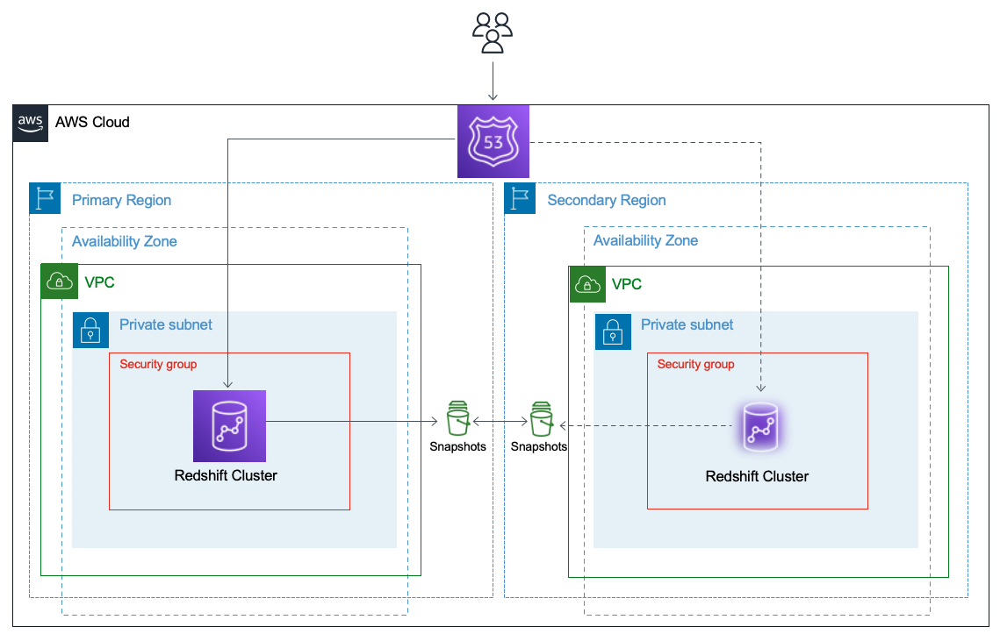

# Simplifying [Amazon Redshift](https://aws.amazon.com/redshift/) Regional Disaster Recovery (DR) using [AWS CloudFormation](https://aws.amazon.com/cloudformation/)
This repo provides guidance on how to restore an Amazon Redshift cluster to a secondary region if the cluster becomes unavailable/unreachable in the primary region. It also shows how to fail back to primary cluster when the primary region is available. The pattern uses AWS CloudFormation to build the cluster in the primary region and also restore it on demand in the second region.  
This repo is used by an [AWS Prescriptive Guidance (APG)](https://aws.amazon.com/prescriptive-guidance/) pattern with the same name. You can find the pattern [here](TBD) in the APG library. 

## Target technology stack
Target technology stack is an Amazon Redshift Cluster with [cross-region snapshot copy](https://docs.aws.amazon.com/redshift/latest/mgmt/working-with-snapshots.html#cross-region-snapshot-copy) enabled, deployed by AWS CloudFormation. You can configure Amazon Redshift to automatically copy snapshots for a cluster to another AWS Region. When a snapshot is created in the cluster's primary AWS Region, it's copied to a secondary AWS Region. If you store a copy of your snapshots in another AWS Region, you can restore your cluster from recent data if the Redshift cluster in primary AWS region is unavailable. You can configure your cluster to copy snapshots to only one AWS Region at a time.

## Prerequisites 
* An [active AWS account](https://aws.amazon.com/premiumsupport/knowledge-center/create-and-activate-aws-account/).
* [AWS Command Line Interface](https://docs.aws.amazon.com/cli/latest/userguide/cli-chap-welcome.html) (AWS CLI), installed and credentials configured. For more information about this, see the [AWS CLI documentation](https://docs.aws.amazon.com/cli/latest/userguide/cli-chap-install.html). 
* A [Git client](https://git-scm.com/downloads), installed and configured.
* Basic understanding of [Amazon Redshift](https://aws.amazon.com/redshift/) is required.

## Limitations 
[Disaster Recovery](https://docs.aws.amazon.com/wellarchitected/latest/reliability-pillar/plan-for-disaster-recovery-dr.html) focuses on one-time recovery objectives in response to natural disasters, large-scale technical failures, or human threats such as attack or error. This is different than availability which measures mean resiliency over a period of time in response to component failures, load spikes, or software bugs. The [recovery objectives](https://docs.aws.amazon.com/wellarchitected/latest/reliability-pillar/disaster-recovery-dr-objectives.html) are defined as follow:  
**Recovery Time Objective (RTO)** is defined by the organization. RTO is the maximum acceptable delay between the interruption of service and restoration of service. This determines what is considered an acceptable time window when service is unavailable.  
**Recovery Point Objective (RPO)** is defined by the organization. RPO is the maximum acceptable amount of time since the last data recovery point. This determines what is considered an acceptable loss of data between the last recovery point and the interruption of service.  

This pattern provides a regional disaster recovery with an RTO of less than 60 minutes using the latest, completed, and available Redshift snapshot copy.  

The RPO depends on the frequency of the automated snapshot which is defined in the [Redshift Snapshot Schedule resource](https://docs.aws.amazon.com/redshift/latest/mgmt/working-with-snapshots.html#automated-snapshot-schedules). By default Amazon Redshift takes a snapshot about every eight hours or following every 5 GB per node of data changes, or whichever comes first. Alternatively, you can [create a snapshot schedule](https://docs.aws.amazon.com/redshift/latest/mgmt/managing-snapshots-console.html#snapshot-schedule-create) to control when automated snapshots are taken. The least supported frequency is one hour.  

Keep in mind depending on the AWS regions involved and the amount of data to be copied to the secondary region, a cross region snapshot copy itself can take hours to complete. For example if the most recent snapshot copy to the secondary region is still in progress and you have to restore the cluster in that region immediately, then you may have to use an older, completed, and available snapshot. In this case your RPO objective will be higher.

## Cost Consideration
Using this guide, you can fail over an Amazon Redshift cluster to a second region and also fail back to the primary region on demand. To avoid additional cost caused by running two identical Amazon Redshift clusters, you can drop the cluster in the primary region when failing over to the second region and drop the cluster in the secondary region when failing back to the primary region. You can delete the cluster by deleting the CloudFormation stack (created from the [`redshift-cluster.yml`](redshift-cluster.yml) CloudFormation template in the AWS console.

## How it works
By following the steps in the next section, you will be able to deploy an Amazon Redshift Cluster in the primary region and enable the Cross-Region Snapshot Copy using AWS CloudFormation. This feature copies the manual or automated Redshift snapshots to the secondary region. If the primary cluster becomes unavailable/unreachable for any reason, then you can resotre the cluster in the second region by deploying the same CloudFomration template in that region. You also will be able to fail back to the primary region using the same CloudFormation template. 

## Steps
1. Determine your primary and secondary regions to deploy the Amazon Redshift cluster.

2. Deploy [`redshift-dependencies.yml`](redshift-dependencies.yml) CloudFormation template in both primary and secondary regions to create the Redshift cluster dependecies (e.g., KMS CMK, IAM role, Redshift Snapshot Copy Grant). These resources are required by the Redshift cluster.

3. Deploy [`redshift-cluster.yml`](redshift-cluster.yml) CloudFomration template to create the Redshift cluster in the primary region. You can find a detailed step by step instructions [here](https://docs.aws.amazon.com/AWSCloudFormation/latest/UserGuide/cfn-console-create-stack.html) on how to deploy an AWS CloudFormation template. Here are the parameters that you need to provide when deploying the stack in the primary region:
      * VpcId 
      * SubnetIds
      * PrimaryRegion
      * SecondaryRegion
      * ClientIpRange  
**Note** the primary region is the one that you are deploying the cluster in. `PrimaryRegion` and `SecondaryRegion` must match the regions that you previously picked in step 1.  
The `ClientIpRange` is a CIDR IP range that can connect to the cluster using JDBC or ODBC connection.  
**Note** It is highly recommended to deploy any resource in private subnets for a secured deployment. To connect to a cluster deployed in a private subnet from your local machine, follow the steps in [this guide](https://aws.amazon.com/premiumsupport/knowledge-center/private-redshift-cluster-local-machine/). You can also use [Amazon Redshift Query Editor](https://docs.aws.amazon.com/redshift/latest/mgmt/query-editor-v2.html) from Amazon Redshift console to connect to the cluster and run your queries.  
Deploying this stack also enables Redshift snapshot copy to the secondary region. This feature will automatically copy Redshift snapshots to the destination (secondary) region.

4. After successfully deploying the [`redshift-cluster.yml`](redshift-cluster.yml) template, make sure the cross-region snapshots is enabled in the cluster maintenance tab from the Amazon Redshift console.

5. Now you need to load some test data to the cluster so you can test the Amazon Redshift cluster failover feature. You can use a sample database called [TICKIT](https://docs.aws.amazon.com/redshift/latest/dg/c_sampledb.html) from Amazon Redshift documentation. Please follow the steps ins3-sample-data-upload.shscript to download the [data files](https://docs.aws.amazon.com/redshift/latest/gsg/cm-dev-t-load-sample-data.html), unzip and upload them to the S3 bucket in the primary region. The bucket has been created in "Deploy Redshift cluster dependencies" epic so you can find the bucket name in the stack outputs from the AWS CloudFormation console.  
After successfully uploading the data into the S3 bucket, [connect to the Redshift cluster](https://docs.aws.amazon.com/redshift/latest/gsg/rs-gsg-connect-to-cluster.html) either from Amazon Redshift Query Editor in Amazon Redshift console or through an SQL client tool, such as SQL Workbench/J. Run the commands provided in [`redshift-data-load-primary-region.sql`](redshift-data-load-primary-region.sql) to create a schema and table (in "dev" database) and load some data using the Amazon Redshift Copy Command. Make sure to provide values for `bucket-name`, `redshift-iam-role`, and `primary-region` variables in the COPY command.

6. After data load is completed, follow the below steps to create a manual Redshift snapshot from Amazon Redshift console:
      * Go to Amazon Redshift page from AWS console.
      * Select the Redshift cluster that you've created in step 3.
      * From the `Actions` drop down on the top right select `Create snapshot` action.
      * In the `Create snapshot` window, give it a name and desired retention period and hit `Create snapshot` button. 
      * Go to the `Maintenance` tab from the cluster dashboard and check the status of the snapshot under the `Snapshots` section. After the snapshot is completed and is in `Available` state, it will be copied to the secondary region.

7. Make sure the snapshot has been copied to the second region (from Amazon Redshift console) and take a note of the snapshot identifier.

8. To failover to the second region (assuming the cluster in the primary region is unavailable/unreachable), you can deploy the cluster in the secondary region using the latest copied snapshot (make sure the state of the snapshot is `Available`). To do this, run [`redshift-cluster.yml`](redshift-cluster.yml) CloudFormation template in the second region (provide the `SnapshotIdentifier` and update the `VpcId` and `SubnetIds` in the template parameters).

9. After the CloudFomration stack is successfully deployed, try to connect to the cluster in the second region and verify the data that you loaded into the cluster in the primary region. Follow the instructions [here](https://docs.aws.amazon.com/redshift/latest/gsg/rs-gsg-connect-to-cluster.html) to connect to the cluster either from Amazon Redshift Query Editor or an SQL client tool, such as SQL Workbench/J.

10. To test failing back to the primary region, perform the following tasks:
      * To change the state of the cluster in the second region, you can load some additional data into the cluster. Again, after uploading the data files to the bucket in the second region and connecting to the cluster, run the the SQL commands in the [`redshift-data-load-second-region.sql`](redshift-data-load-second-region.sql) to load more data into the Redshift cluster. Make sure to provide values for `bucket-name`, `redshift-iam-role`, and `secondary-region` variables in the COPY command.
      * After data load is completed, create a manual Redshift snapshot from AWS console in the second region.
      * Check the status of the copied snapshot in the primary region and make sure is in `Available` state. Take a note of the snapshot identifier.
      * Update the Amazon Redshift cluster stack form the CloudFormation console in the primary region. Use the same CloudFormation template and make sure you provide the `SnapshotIdentifier` from which you want to resotre the cluster. 
      * After the stack update is completed, connect to the cluster in the primary region and verify the data that you recently loaded into the cluster. 
 

## Clean up
To clean up the resources that you've created during this guide:
1. Empty the S3 buckets in both regions.

2. [Delete the Redshift cluster stacks](https://docs.aws.amazon.com/AWSCloudFormation/latest/UserGuide/cfn-console-delete-stack.html) (stacks created by [`redshift-cluster.yml`](redshift-cluster.yml) CloudFormation template) from the AWS Cloudformation console in both regions. Make sure the stack deleteions are completed before go to the next step. 

3. Delete the Redshift dependencies stacks (stacks created by [`redshift-dependencies.yml`](redshift-dependencies.yml) CloudFormation template) from the AWS CloudFormation console in both regions.